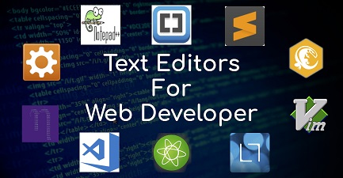

## Choosing a text Editor ##

### What to look for ###

- Code completion
    + The text editor gives you suggestions based on the code you started
    + Will close tags when you create one
- Syntax highlighting
    + changes the color of text, making it much easer to view
- access to alot of extenstions 
- Being able to choose themes!
    + dark themes, lights themes what ever you want
    + makes it easy on the eyes

