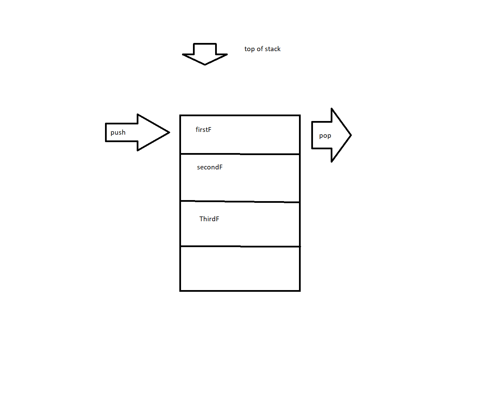

# In memory storage

## Understanding the JavaScript Call Stack

**What is a ‘call’?**

When a function is invoked.

**How many ‘calls’ can happen at once?**

Just one call at a time.

**What does LIFO mean?**

Last In, First Out

**Draw an example of a call stack and the functions that would need to be invoked to generate that call stack.**

```js

function firstF(){
  console.log('Hi!');
}

function secondF(){
  firstF();
}

function thirdF(){
  secondF();
}

thirdF();

```



**What causes a Stack Overflow?**

Stack Overflow occurs when a function calls itself with no exit point.

## JavaScript error messages

**What is a ‘refrence error’?**

When code has a variable that is undefined.

**What is a ‘syntax error’?**

Happens when you have something that cannot be parsed because of incorrect syntax

**What is a ‘range error’?**

Trying to give a object or array a invalid length.

**What is a ‘tyep error’?**

Happens when you are trying to types that are incompatible

**What is a breakpoint?**

A point in your code that your code will not pass unless a condition is met

**What does the word ‘debugger’ do in your code?**

The conditional statement you set at your breakpoint

## Things I want to know more about