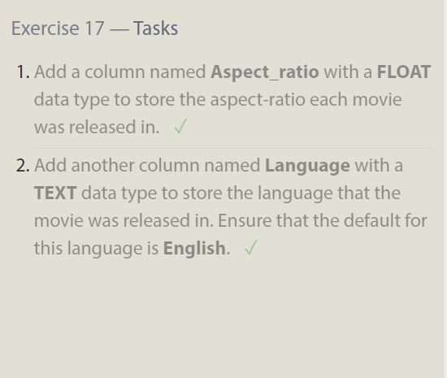

# Introduction to SQL

## Lessons 1-3

The first three lessons were very straight forward and easy to understand. I feel like its just working through a new syntax for filtering. I learned how to filter for columns and rows using WHERE and conditions.

## Lessons 4-6

Diving a little deeper into using Sql for more real world problems felt good. I learned how to order and my table and limit what I query. My biggest issue was just double checking spelling and making sure I had the correct names for columns

## Lesson 13-15

I learned how to add rows and columns, update and delete individual cells. I also realized how finicky sql commands can be.

## lessons 16-18

I learned how to Create a new table form scratch, add new columns and specify what data types can be put into those columns. I learned how to delete both the table and its scheme.

