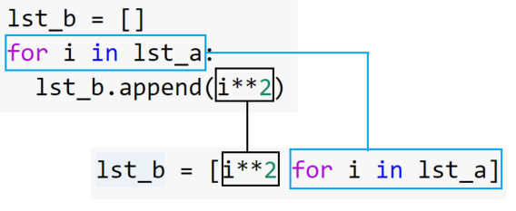

# Ten Thousand 3

## Great site I found for explaining converting loops to list comprehension



<cite>How to Convert Loops to List Comprehensions in Python,https://towardsdatascience.com/how-to-convert-loops-to-list-comprehension-in-python-15efcc696759</cite>

## List Comprehensions

list Comprehensions syntax

```python
new_list = [expression for item in list]
```

list Comprehensions requires three things

- The expression to carry out
- The object that expression will work one
- A iterable list of objects to build out new list

## Create a List with range()

example

```python

new_range = [x for x in range(10)]

# output
[0, 1, 2, 3, 4, 5, 6, 7, 8, 9]

```

## Create a List Using Loops

```python

squares = [x**2 for x in range(10)]

# output
[0, 1, 2, 3, 4, 5, 6, 7, 8, 9]

```

## You can add arguments to list Comprehensions

```python

x = [double(x) for x in range(10)]

# output
[2, 4, 6, 8, 10, 12, 14, 16, 18]

```

<cite>List Comprehensions in Python,https://www.pythonforbeginners.com/basics/list-comprehensions-in-python</cite>

## Parsing a file using list comprehension

```python
file = open("file.txt")
file = [line for line in file]
```

## Things I want to know more about

pysnooper looks like a great compromise from running debugger and print statements
