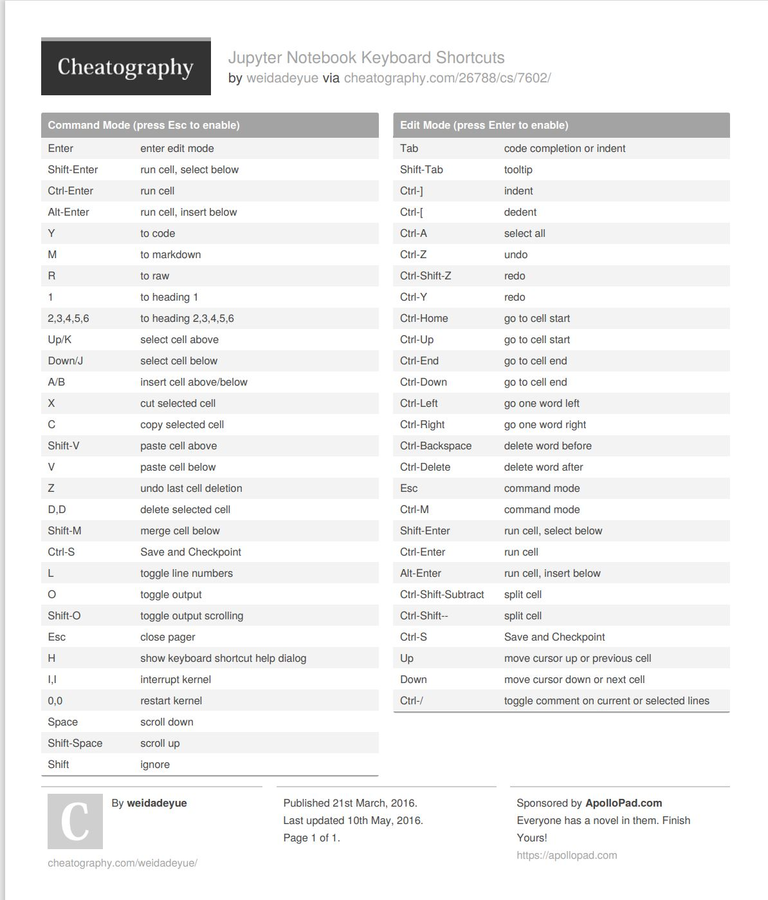

# Data Analysis

## What is Jupyter Lab

JuypterLab is a web-based interface for project JuypterLab

## jupyter keyboard short cuts

y - to code

m - to markdown

a - add cell above

b - add cell below

c - copy cell

v - paste cell

x - cut cell

Found this great cheat sheet for shortcuts in windows



## Numpy Tutorial

Numpy is the core library for scientific and numerical computing


In Numpy dimensions are refereed to as axis


**one - dimension array**

1 2 3 4 5 

Shape (5,)

**Two - dimension array**


1 2 3 4 5
6 7 8 9 1

Shape (2,5)

### Creating A NumPy Array


Create a NumPy array using the np.array function.


```py
import csv
with open("winequality-red.csv", 'r') as f:
    wines = list(csv.reader(f, delimiter=";"))
import numpy as np
wines = np.array(wines[1:], dtype=np.float)

```

Use wines.shape to check the shape property

`wines.shape`

returns

`(1599, 12)`


### Alternative NumPy Array Creation Methods

array of zeros

`empty_array = np.zeros((3,4))`

array of random numbers

`np.random.rand(3,4)`

Remember Numpy is 0 index


## Slicing NumPy Arrays

use colon (:)

`wines[0:3,3]`

A colon indicates that we want to select all the elements from the starting index up to but **not** **including** the ending index.

This would look like,

`array([ 1.9, 2.6, 2.3])`

Select an entire column by specifying that we want all the elements by using empty :

`wines[:,3]`

Select an entire row by specifying that we want all the elements by using empty :

`wines[3,:]`


### Assigning Values To NumPy Arrays

`wines[1,5] = 10`

<cite>NumPy Tutorial: Data Analysis with Python,https://www.dataquest.io/blog/numpy-tutorial-python/</cite>
